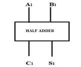
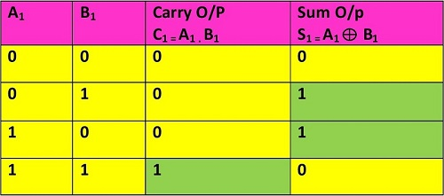
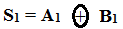
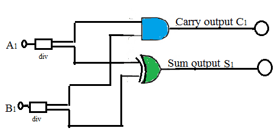

### 1 INTRODUCTION

Experiments 1 to 13 focus on the fundamentals of basic logic and universal gates and also the XOR gates and their application in different consumer and industrial applications. The applications we studied include simple car wiper control, industrial control, fuel level control, seat belt warning, washing machine control, water level control, automobile alarm system, level monitoring in chemical plant, staircase light control, cockpit warning control etc. These experiments have laid a sound foundation for the use of gates in conceptualizing the application areas.

This experiment will help you to design any application based on combinational logic using the generalized simulator framework built for only two input logic gates.

#### 1.1 HALF ADDER
|Description | Adds two single bits and produces a SUM and a CARRY output.|
|-------|--------------------|
|Symbol||
|Truth Table|| 
#### 1.2 DESIGN OF HALF ADDER CIRCUIT

Half Adder (HA) circuit is a digital circuit using logic gates that adds two single bit numbers A1 and B1 and produce outputs Sum S1 and Carry C1. To design a HA circuit following steps should be followed:

1. Prepare a truth table as shown above.

2. Write down the simplified Boolean expressions for output S1 and C1. As Carry output goes HIGH only when both inputs are HIGH, the expression for Carry output C1 = A1 . B1 ; whereas the Sum output goes HIGH when odd number of inputs are HIGH. Therefore we may write the expression for Sum as:  
3. Draw the connection diagram as shown in Figure 1: 

 

Figure 1: Half adder

4. Verify the working of half adder.

5. To design any combinational circuit, a similar approach may be adopted as suggested in the procedure above.

